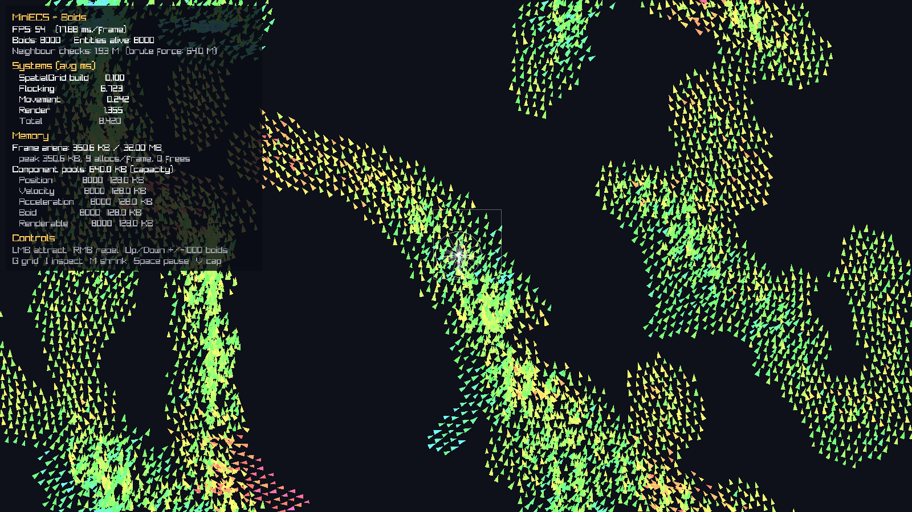
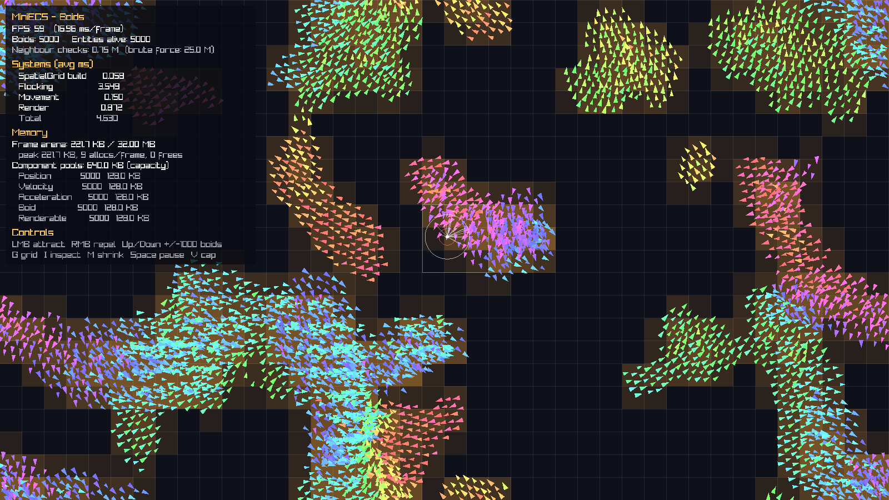

# MiniECS

A lightweight Entity Component System implemented from scratch in modern C++20,
with custom memory allocators and a real-time boids demo.
The library has no dependencies beyond the standard library. The demo uses raylib.



```cpp
ecs::Registry registry;

ecs::Entity player = registry.createEntity();
registry.emplace<Position>(player, 0.0f, 0.0f);
registry.emplace<Velocity>(player, 10.0f, 5.0f);

registry.view<Position, Velocity>().each([dt](Position& p, const Velocity& v)
{
    p.x += v.x * dt;
    p.y += v.y * dt;
});
```

## Features

- **Generational entity handles**: IDs are recycled, and each reuse bumps a generation
  counter. Stale handles to destroyed entities are detected and can never read or write
  another entity's data.
- **Sparse-set component storage**: O(1) `has` / `get` / `emplace` / `remove` with no
  hashing. Component data is kept tightly packed for cache-friendly iteration.
- **Multi-component views**: `view<A, B, C>()` iterates only the entities that have all of
  the requested components. The cost scales with the *smallest* pool.
- **Safe structural changes during iteration**: views walk back-to-front, so destroying
  the current entity inside `each()` is safe.
- **Systems and a profiling scheduler**: logic lives in `ecs::System` subclasses that run
  in order. The scheduler measures each system's time every frame.
- **Custom allocators** (`include/ecs/memory/`):
  - `LinearAllocator`: an arena for per-frame scratch data. Allocation is a pointer bump,
    and the whole frame is freed with one `reset()`. It tracks its peak usage and
    reports overflow instead of corrupting memory.
  - `PoolAllocator` / `ObjectPool<T>`: a fixed-size block allocator with an intrusive
    free list. Allocate and free are O(1), pointers stay stable, and the pool grows by
    chunks.
- **Memory introspection**: `registry.poolStats()` reports each component pool's
  name, count and bytes (dense data, entity list, sparse array). `shrinkToFit()` returns
  unused capacity.
- **Tested**: 31 unit tests, including regression tests for entity recycling bugs and
  allocator edge cases (alignment, overflow, reuse).
  The build is warning-free with `-Wall -Wextra -Wpedantic -Wshadow -Wconversion` and
  clean under AddressSanitizer and UBSan.

## Boids demo

`demo/` contains a real-time flocking simulation built on the library:

- Thousands of boids with separation, alignment and cohesion (Reynolds). The mouse
  attracts or repels them.
- **A spatial grid rebuilt every frame in a `LinearAllocator`**. The grid is a counting
  sort by cell, so each cell's boids are contiguous in memory. A neighbour query then
  walks 9 short packed ranges instead of testing all N² pairs. At 8,000 boids this is
  about 2M checks per frame instead of 64M.
- A live overlay with FPS, per-system timings, frame-arena usage (allocations per frame,
  peak) and per-component-pool memory.
- Debug views: a grid occupancy heat map (`G`) and an inspector (`I`). The inspector shows
  the boid under the cursor, its 3×3 candidate cells, its perception radius and the
  neighbours it actually uses.



| Input | Action |
|---|---|
| Left / right mouse | Attract / repel |
| Up / Down (Shift ×5) | Add / remove 1,000 boids. This exercises entity creation, destruction and ID recycling at runtime. |
| G / I | Grid heat map / boid inspector |
| M | `shrinkToFit()` on all component pools (watch the memory panel) |
| Space / V / H | Pause / toggle 60 FPS cap / hide overlay |

The ECS systems in the demo:

```
SpatialGridSystem   arena.reset(); counting-sort boids into cells (frame arena)
FlockingSystem      view<Position, Velocity, Acceleration, Boid> + grid neighbours
MovementSystem      integrate, clamp speed, wrap around the world
RenderSystem        view<Position, Velocity, Renderable>, triangles coloured by heading
```

## Design

```
Registry
├── EntityManager          generations[id-1], free list of IDs
└── pools[componentTypeId<T>()] -> ComponentPool<T> (sparse set)
        sparse     : EntityID -> dense index (or NPOS)
        entities   : [e7, e2, e9, ...]          dense
        components : [T,  T,  T,  ...]          dense, contiguous
```

### Key decisions and trade-offs

| Decision | Why | Cost |
|---|---|---|
| Sparse set instead of `unordered_map<EntityID, index>` | No hashing; lookup is a single array index. Dense arrays iterate linearly. | `sparse` grows to the highest entity ID that has the component (4 bytes per ID). |
| Swap-and-pop removal | O(1), keeps data packed. | Component order is not stable. |
| Component type IDs from a static counter | Pools sit in a `vector` indexed by type, so pool lookup needs no `type_index` hashing. | IDs depend on first-use order, so they must not be serialized. Not thread-safe on first use. |
| View iterates the smallest pool | `view<Position, Boss>` with 1M positions and 3 bosses checks 3 entities, not 1M. | Each candidate pays one sparse lookup per extra component type. |
| Reverse iteration in views | Removing the current element only moves already-visited data. | Iteration order is reversed relative to insertion. |
| `destroyEntity` removes from every pool | Recycled IDs start clean (this fixed a real bug in v1.0). | O(number of component types) per destroy. |
| Arena for per-frame data | No per-frame heap traffic and no fragmentation. Freeing is O(1). | Fixed capacity, so overflow must be handled (reported, never silent). No destructors. |
| Counting sort for the spatial grid | Each cell's boids are contiguous. Two linear passes, no per-cell containers. | Needs a gather buffer and a scatter pass every frame. |
| Pool allocator with intrusive free list | O(1), no per-allocation header, stable addresses. | One block size per pool. Memory is not returned to the OS until the pool dies. |

## Benchmarks

`benchmarks/ecs_benchmark.cpp` updates `Position += Velocity * dt` with half of the
entities moving. It compares three approaches:

- **view**: `view<Position, Velocity>().each(...)` on sparse sets
- **has()/get()**: looping over every entity and querying it individually (the v1.0
  system style), on the new storage
- **baseline**: the v1.0 storage, `vector` + `unordered_map<EntityID, index>`

**Windows, MSVC 19.51 (Visual Studio 2026 Build Tools), Release, `/W4`**

| Entities | view | has()/get() | baseline (unordered_map) | Speed-up |
|---:|---:|---:|---:|---:|
| 10,000 | 0.014 ms | 0.059 ms | 0.126 ms | ~9× |
| 100,000 | 0.123 ms | 0.604 ms | 1.576 ms | ~13× |
| 1,000,000 | 1.426 ms | 6.096 ms | 65.764 ms | ~46× |

**Linux, GCC, Release (cloud VM, Intel Xeon @ 2.1 GHz)**

| Entities | view | has()/get() | baseline (unordered_map) | Speed-up |
|---:|---:|---:|---:|---:|
| 10,000 | 0.006 ms | 0.057 ms | 0.109 ms | ~17× |
| 100,000 | 0.079 ms | 0.629 ms | 1.091 ms | ~14× |
| 1,000,000 | 0.877 ms | 6.255 ms | 11.135 ms | ~13× |

*Per-frame times for one `Position += Velocity * dt` pass.*

### Observations

- The view beats per-entity `has()/get()` on the *same* storage by roughly 4-10×. The
  view only visits the smallest pool, and it never touches entities that cannot match.
- The hash-map baseline degrades sharply at 1M entities on MSVC (~66 ms vs ~11 ms on GCC).
  The likely cause is that the hash table no longer fits in cache, and MSVC's
  `unordered_map` (buckets pointing into a linked list) needs several dependent memory
  loads per lookup. The sparse set's lookup is a single array index, so it stays
  predictable across compilers and standard libraries.

### Memory benchmarks

`benchmarks/memory_benchmark.cpp` (Linux, GCC, Release, cloud VM):

**Per-frame spatial grid rebuild** (1600×900 world, 40 px cells). A `vector` per cell is
rebuilt every frame, compared with an arena plus counting sort:

| Points | vector per cell | arena + counting sort | Speed-up | Arena peak |
|---:|---:|---:|---:|---:|
| 10,000 | 0.227 ms | 0.033 ms | ~6.8× | 0.08 MB |
| 100,000 | 0.757 ms | 0.402 ms | ~1.9× | 0.77 MB |
| 1,000,000 | 6.529 ms | 5.053 ms | ~1.3× | 7.64 MB |

**Fixed-size object churn**: allocate N objects, then free and refill a random half each
round. `new`/`delete` compared with `ObjectPool<T>`:

| Objects × rounds | new/delete | PoolAllocator | Speed-up |
|---:|---:|---:|---:|
| 10,000 × 50 | 4.54 ms | 1.83 ms | ~2.5× |
| 100,000 × 20 | 51.84 ms | 28.52 ms | ~1.8× |
| 1,000,000 × 5 | 269.29 ms | 150.51 ms | ~1.8× |

The arena's advantage is largest at the sizes a game actually runs (thousands of
objects), where per-cell heap allocations dominate. At 1M points, both versions are bound
by the random-access scatter into memory, so the allocation strategy matters less.

## Building

Requires CMake 3.20+, Git and a C++20 compiler (MSVC 2022+, GCC 11+ or Clang 14+).
The first configure downloads raylib 5.5 for the demo. Pass `-DMINIECS_BUILD_DEMO=OFF` to
skip it. On Linux, raylib needs the X11/OpenGL development packages.

```bash
cmake -B build -DCMAKE_BUILD_TYPE=Release
cmake --build build --config Release

# On Windows the executables are in build\Release\
./build/MiniECS_boids              # boids demo
./build/MiniECS_example            # console example
ctest --test-dir build -C Release --output-on-failure
./build/MiniECS_benchmark          # ECS storage benchmark
./build/MiniECS_memory_benchmark   # allocator benchmark
```

CMake options: `MINIECS_BUILD_EXAMPLES`, `MINIECS_BUILD_TESTS`, `MINIECS_BUILD_BENCHMARKS`,
`MINIECS_BUILD_DEMO` (all ON), and `MINIECS_SANITIZERS` (OFF, GCC/Clang only).

## Project layout

```
include/ecs/
  Entity.h          handle (id + generation)
  EntityManager.h   ID allocation and recycling
  ComponentPool.h   sparse-set storage + type-erased IComponentPool
  ComponentType.h   per-type dense IDs
  View.h            multi-component iteration
  Registry.h        public API
  System.h          System base class + profiling Scheduler
  TypeName.h        readable type names for debug output
  ECS.h             umbrella header
  memory/
    LinearAllocator.h   arena / bump allocator
    PoolAllocator.h     fixed-size block allocator + ObjectPool<T>
src/                EntityManager.cpp
demo/               raylib boids demo (spatial grid, flocking, rendering, overlay)
examples/           console example with movement + lifetime systems
tests/              dependency-free unit tests (run via CTest)
benchmarks/         ECS storage and allocator benchmarks
docs/               screenshots
```

## Roadmap

- [x] Custom allocators (arena, pool) with tests and benchmarks
- [x] Interactive demo: boids with a spatial grid, profiling and memory overlay
- [ ] Component storage backed by custom allocators (paged sparse set)
- [ ] Archetype-based storage and a comparison against sparse sets
- [ ] Deferred command buffer for structural changes during iteration
- [ ] Event or observer hooks (`onConstruct<T>`, `onDestroy<T>`)
- [ ] Multithreaded flocking (the grid is read-only during the update)
- [ ] CI with GitHub Actions on Windows (MSVC) and Linux
